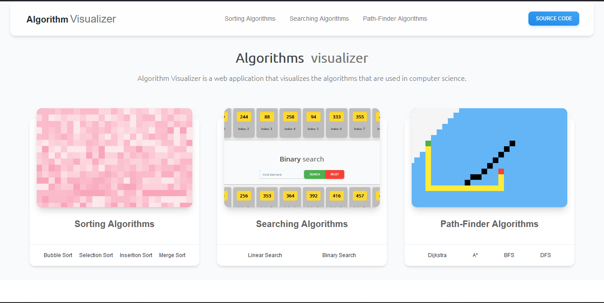
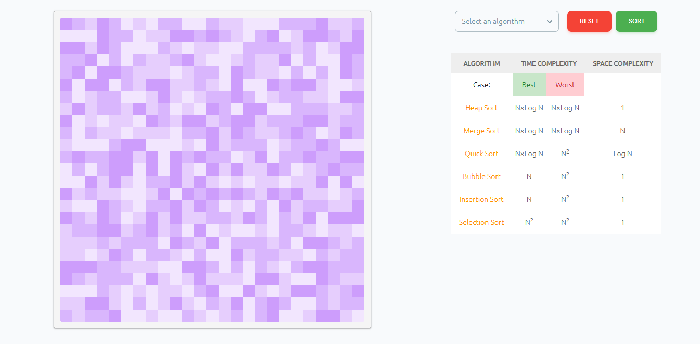
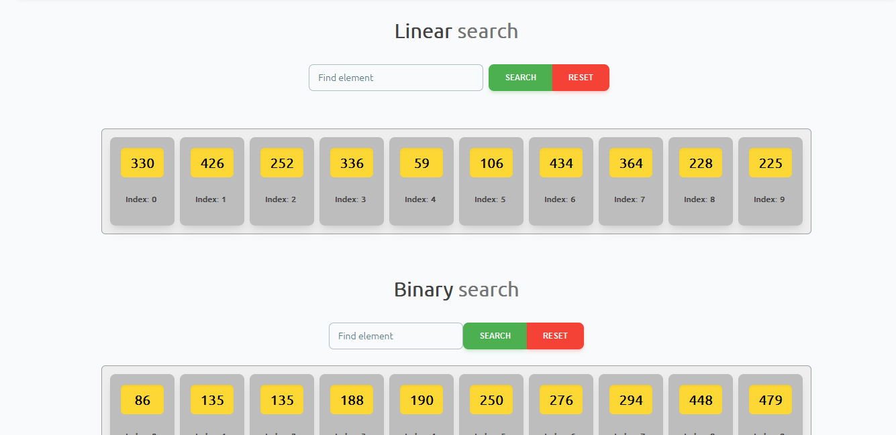
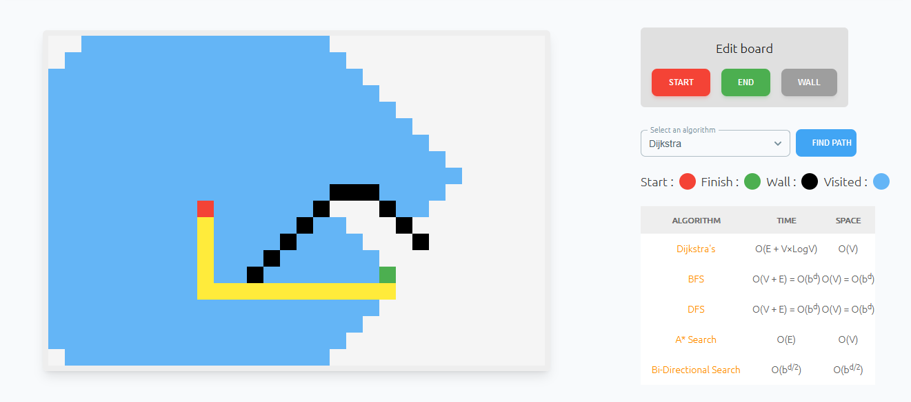

Algorithm Visualizer.
=======================

Algorithm visualizer is a web application which help us in learning and better understanding of algorithms by using animations and visual graphics, it show how deep down an algorithm work.
---------------------------------

## You can access it here : [Algorithm Visualizer](https://6302b345f0b2c96308040b7c--algo-visualizer-ishan.netlify.app/)

## This algorithms visualizer provide three types of algorithm visualization.

* ### Sorting visualizer
* ### Searching visualizer
* ### Path-finding visualizer
------------------------------------

### `Sorting visualizer`

This `sorting visualizer` show how different type of sorting algorithms sort an array.

### Sorting algorithms in it :-

* Bubble sort
* Selection sort
* Insertion sort
* Merge sort
* Quick sort
* Heap sort

### `Searching visualizer`

Using animations `searching visualizer` show how the different types pf searching algorithms search a particular element in an array.

### Searching algorithms in it :-

* Linear search
* Binary search

### `Path-finding visualizer`

In `Path-finding visualizer` their is a grid with `"x"` number of rows and `"y"` number of columns also having a source node and a destination node which is randomly placed, by using different types of pathfinding algorithms it find the shortest path between the source and destination and show on the grid using animations and some visualization techniques.

### Path-finding algorithms in it :-

* Breadth first search
* Depth first search
* Dijkstra
* A*

